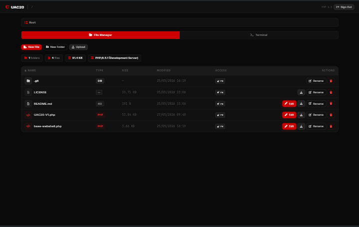
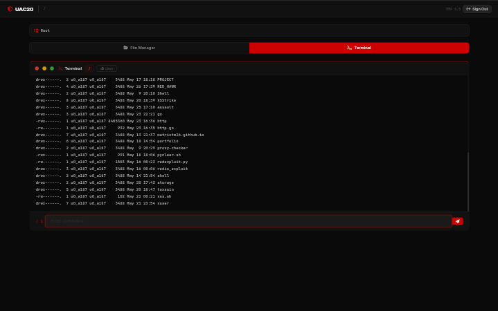
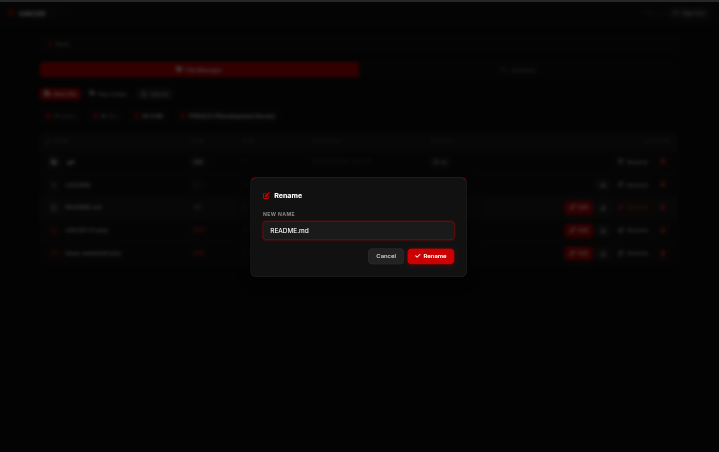

# UAC20 GROUP PHP Webshell backdoor

Created for red teaming and penetration testing.


---

## OVERVIEW

Overview of UAC20 webshell panel

Main panel overview


---

Terminal / cmd overview


---

Another panel overview


---

#  Security Notes

> [!IMPORTANT]
> This is early development version of this shell

## AUTHENTICATION

**SHELL LOGIN PASSWORD**

```txt
SECUR1TY F1R5T
```

---

##  Credit

- **Author:** [@MatrixTM26](https://github.com/MatrixTM26)

##  Support Me

[](https://ko-fi.com/MatrixTM26)
[](https://trakteer.id/MatrixTM26)
[](https://paypal.me/TeukuMaulana)

---

<p align="center">Copyright &copy;2023-2026 MatrixTM26 • All Rights Reserved</p>
